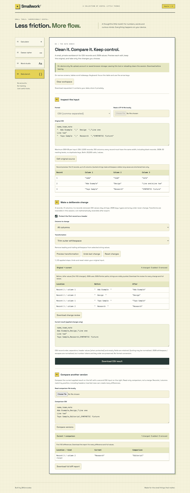

# Smallwork / Angular Mini Projects

Four on-device tools in Angular 21, with standalone components and lazy routes. The new **Data bench** adds reviewed CSV/JSON cleanup and structured comparison to the calculator, Caesar cipher and word studio. The original graph-paper, yellow and green design is retained.

This is a new implementation of Josiah Adeyemo's portfolio concepts, not the original Angular 4 source. It is a local browser utility, not a deployed service.

## Run Locally

Use Node 22.16+ (22.x) or Node 24+.

```sh
npm ci
npm run dev
```

Development: [Data bench on port 5309](http://127.0.0.1:5309/data). For the loopback-only production preview with restrictive CSP:

```sh
npm run build
npm run preview
```

Production preview: [Data bench on port 5310](http://127.0.0.1:5310/data). `PORT` can override the preview port. The repository-owned browser tests reserve 5310 and refuse to reuse an existing server; stop your preview before testing. No accounts, credentials, database or provider setup is required. No external fonts or runtime APIs are used.

## Data Bench Workflow

1. Choose comma-separated CSV or JSON. Paste text, read a UTF-8 file locally, or explicitly load the synthetic example. **Validate & open** reports physical line/column errors and CSV record numbers. Invalid documents never become a cleanup session, even if some records are valid.
2. Choose one transformation: outer-whitespace trim, horizontal-space/tab collapse, lowercase, uppercase, string line-break normalization, or CSV formula-prefix guarding. CSV offers an explicit first-record/header protection toggle and all-column or single-column scope. JSON edits string values only, never keys, types or array positions.
3. **Preview transformation** shows proposed before/after values and changed/added/removed counts without changing the current result. **Download change review** includes every change and full values, including before applying. **Apply reviewed transformation** adds a recoverable step; no-ops do not consume history. Undo returns one step; reset restores the original parsed document. Editing the source after changes requires discarding them explicitly.
4. Download the applied CSV/JSON result. A pending preview is never accidentally downloaded as the current result. Original files are not overwritten. Formula-like CSV cells, including headers, block normal download until explicitly guarded or acknowledged for unchanged export. Risk acknowledgement resets after apply, undo or reset.
5. Paste/read a second document of the same format and compare it to the current applied result. Comparison is read-only, not a merge. Export the complete diff as JSON. Editing comparison input or applying/undoing changes invalidates the old report.

### Data And Comparison Rules

- CSV supports quoted commas, doubled quotes, multiline fields, optional UTF-8 BOM, empty cells, blank records, trailing separators and CR/LF/CRLF record endings. All records must have the first record's width, including blank records. Width errors are not "fixed" by dropping/padding rows. Headers are not interpreted as object keys; duplicates remain intact. Values stay strings: `001`, `false` and dates are not converted.
- CSV exports retain record/column order, decoded field values, the BOM and each parsed record's line ending; field quoting can change. An empty field is explicitly quoted in exports. The browser can normalize line endings when pasting/editing a textarea; use file intake to retain original record endings. The unmodified source stays in session memory.
- JSON supports all root value types and nested objects/arrays. A strict bounded parser rejects comments, trailing commas, invalid escapes and duplicate decoded object keys. Object entries are stored without assigning user-controlled object properties, so `__proto__` and `constructor` remain inert data. No `eval` or dynamic code execution is used.
- JSON number tokens are preserved verbatim, including integers beyond JavaScript's safe range, decimal precision, exponent notation and `-0`. Numbers are never converted to floating point. Exports use compact JSON and normalize string escaping/whitespace, but retain key order, types and array order. This is structural preservation, not byte-identical serialization.
- CSV diff matches records and columns by position, including headers. It does not infer stable IDs or detect moved rows. JSON diff uses JSON Pointer paths, matches arrays by index and ignores object-key order. Exact number spellings differ (`1` versus `1.0`). A missing or type-changed subtree counts once, rather than counting every descendant. Empty values, `null` and absence remain distinct. Diff JSON contains serialized value text, not an executable patch.
- Spreadsheet formula guarding deliberately prefixes selected formula-like strings with an apostrophe and is itself undoable. Include the first record and all columns to cover the whole file. It is not a universal spreadsheet sandbox: import untrusted columns as text and review settings in the target application. An unchanged risky CSV is available only through explicit acknowledgement.

### Bounded Scope

Each source/comparison is limited to **256 KiB of UTF-8**. Oversized files, pasted text or edits are rejected visibly, retaining the previous input. Files with invalid UTF-8 are rejected rather than decoded with replacement characters. CSV allows **2,000 records, 100 columns and 20,000 cells**. JSON allows **32 nested containers and 20,000 values**, including containers. A transformed serialized result must also fit 256 KiB.

History holds up to **20 applied steps**; reaching the limit blocks another apply rather than evicting the oldest undo. A diff's combined paths and before/after text is capped at **2,000,000 UTF-16 units** to bound path amplification. Exceeding it rejects the entire comparison/proposal, never reports a partial diff. Inputs are processed synchronously within these limits; no large-file streaming is offered.

The UI shows up to 8 CSV preview records / 6 columns, 100 changes and 180 characters per displayed value, with explicit truncation labels. Downloaded review/diff reports contain all changes and full values. Up to 100 CSV width errors plus the first syntax error are shown. Tables scroll horizontally on narrow screens and are keyboard focusable. There is no automatic type inference, deduplication, row deletion, delimiter detection, schema validation, JSON-to-CSV conversion, regex scripting or merge operation.

## Privacy Boundaries

Inputs and undo snapshots stay in the active component's memory. There is no upload endpoint, telemetry, local/session storage, IndexedDB, cookie, service worker or backend persistence. Reloading, closing the page or changing tools loses the session; download before leaving. Clear workspace confirms before removing both inputs/results/history from this page. It does not securely erase browser/OS memory or delete previously downloaded files.

Downloads and exported reviews contain your data in plaintext. Browser extensions, clipboard tools, the browser/OS and anyone with access to downloaded files are outside this app's privacy boundary. No encryption or access control is claimed. Do not treat the educational Caesar cipher as secure encryption.

The production preview binds to `127.0.0.1`, accepts GET/HEAD only, and sends CSP with `connect-src 'none'`, `object-src 'none'`, `form-action 'none'`, and self-hosted script/style assets. Development uses the Angular dev server and its local live-reload connection instead. AOT builds do not require `unsafe-eval`; critical-CSS inlining is disabled. A future static host must provide equivalent security headers and serve `dist/browser/index.html` for `/calculator`, `/cipher`, `/words` and `/data`. No public hosting was performed.

## Verification

```sh
npm test
npm run build
PLAYWRIGHT_CHANNEL=chrome npm run test:browser
```

With no installed Chrome, run `npx playwright install chromium`, then `npm run test:browser` without the channel variable. Tests launch a fresh isolated production preview at 5310 and fresh browser contexts; no real data, external accounts or credentials are used.

Verified locally on 2026-09-10: **22 core tests**, **10 desktop/mobile Chrome workflow cases**, and the production build passed. Core tests include lossless number handling, malicious-looking keys, parser/size/depth errors, positional diff rules, formula detection, history limits, amplified diff limits and 60 generated roundtrip fixtures. Browser tests verify downloaded bytes/reports, asynchronous UTF-8 intake, invalid/oversized input recovery, formula acknowledgements, original preservation, stale previews, clear/reload behavior, no data requests/storage, existing-tool regressions, automated WCAG A/AA checks and viewport overflow. Mobile is a 390px Chrome emulation, not a real-device or manual screen-reader certification. CI is configured for core/build/Chromium checks; this uncommitted batch has not run in remote CI.

Actual synthetic-data screenshots captured by the browser tests:



[Mobile workflow](docs/data-mobile.png) · [Desktop JSON diff](docs/diff-desktop.png) · [Mobile JSON diff](docs/diff-mobile.png)

## Existing Utilities

- Calculator: bounded recursive-descent arithmetic with precedence, parentheses, unary signs and powers. IEEE floating point, not exact financial arithmetic.
- Caesar cipher: reversible A-Z substitution with negative shifts and punctuation preservation. Educational only.
- Word studio: mechanical sentence/title/upper/lower case, whitespace cleanup and Unicode-aware word counts, not linguistic editing.

The original [calculator screenshot](docs/preview.webp) is retained. No existing utility or data was removed.
