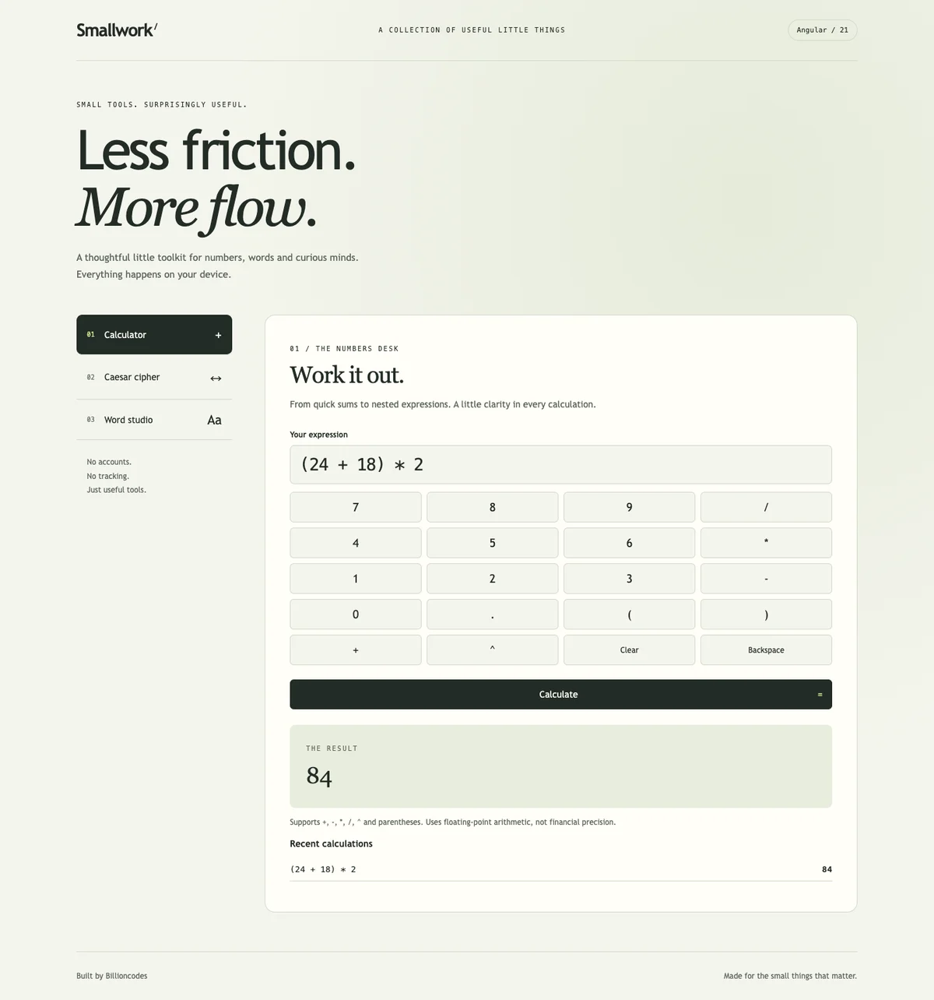

# Smallwork / Angular Mini Projects



Three purposeful browser tools, built with Angular 21 standalone components and lazily loaded routes.

This is a new implementation of the calculator, Caesar cipher and word formatter concepts from Josiah Adeyemo's portfolio. It is not the original Angular 4 source.

## Run and test

Node 22.16+ (22.x) or Node 24+ is required.

```sh
npm ci
npm run dev
npm test
npm run build
```

Open http://127.0.0.1:5104. Production output is dist/browser; configure your static host to fall back to index.html for /calculator, /cipher and /words.

For a local production preview, run `npm run build` followed by `npm run preview`. It serves port 5104 with a restrictive Content Security Policy. Critical-CSS inlining is disabled so stylesheet loading does not require inline JavaScript.

## Tools

- Calculator: parentheses, unary signs, powers and operator precedence using a bounded recursive-descent parser. No eval or dynamic code execution.
- Caesar cipher: reversible A-Z substitution, negative shifts and punctuation preservation. This is educational, NOT secure encryption.
- Word studio: sentence/title/upper/lower case, whitespace cleanup and Unicode-aware word counts. Case changes are mechanical, not linguistic editing.

The app has no backend, telemetry, external requests or persistence. Text stays in browser memory and clears on reload. Arithmetic uses IEEE floating point and is not suitable for exact money calculations. Dependencies are lockfile-pinned and production builds use Angular's ahead-of-time compiler.
